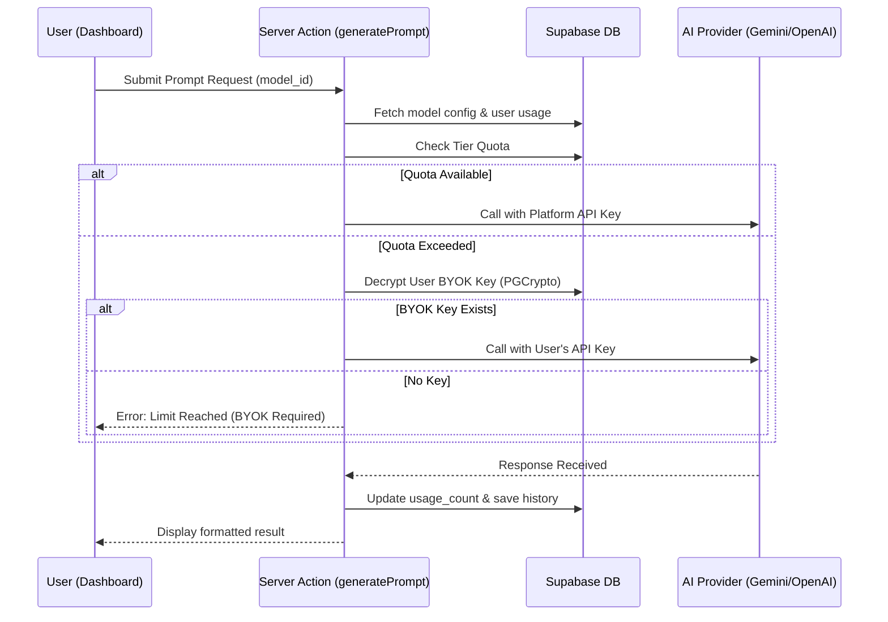
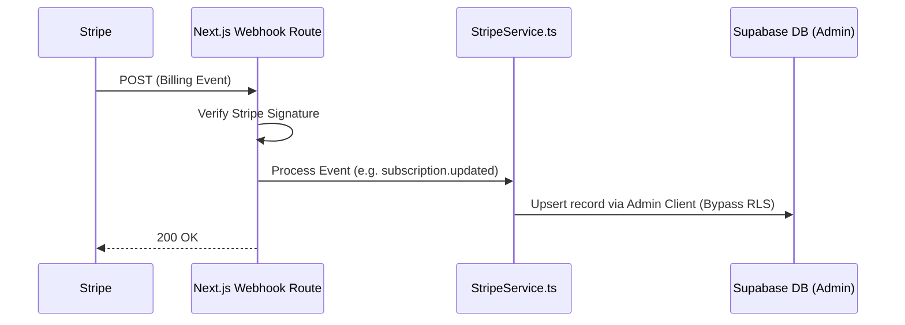

# PromptGen Architecture & Implementation Guide

## 1. Overview
PromptGen is a high-performance AI Prompt Engineering SaaS platform. It enables users to architect optimized prompts using dynamic blueprints (templates) and visual style signatures, with support for major AI providers (Google Gemini, OpenAI).

### Key Features
- **Dynamic Blueprints**: Database-driven prompt templates with custom parameters.
- **Visual Signatures**: Curated aesthetic styles applied to generations.
- **Monetization**: Tiered subscription model (Monthly/Yearly) via Stripe.
- **BYOK (Bring Your Own Key)**: Fallback logic allowing users to use their own API keys once system quotas are reached.

---

## 2. Technical Architecture

PromptGen follows a modern Serverless architecture using **Next.js 14 (App Router)** and **Supabase**.

### 2.1 Technology Stack
- **Frontend**: React 18, Tailwind CSS, shadcn/ui.
- **Backend/API**: Next.js Server Actions & API Routes (Logic migrated from Supabase Edge Functions for better DX and deployment).
- **Database**: PostgreSQL (Supabase) with Row Level Security (RLS).
- **Authentication**: Supabase Auth (Email/Password).
- **Payments**: Stripe Billing + Webhooks.
- **AI Integration**: Google Generative AI (Gemini), OpenAI.

### 2.2 Repository Structure
```text
promptify/
├── .github/            # GitHub Actions (CI/CD for Next.js & Supabase)
├── docs/               # Architecture & Guides
├── public/             # Static Assets
├── src/
│   ├── app/            # App Router, Server Actions & API Routes
│   ├── components/     # UI Components (Dashboard, Landing, Settings)
│   ├── hooks/          # React hooks & dynamic config
│   ├── lib/            # Shared utilities (Stripe, Supabase, AI Services)
│   └── types/          # TypeScript definitions
├── supabase/
│   └── migrations/     # Single Consolidated Migration Schema
├── .env.local          # Environment Variables
├── next.config.ts      # Next.js Config
└── package.json        # Dependencies
```

---

## 3. Database Layer (Supabase)

The core logic is stored in a **single consolidated migration file** (`20260120000000_consolidated_schema.sql`).

### Core Tables
| Table | Description |
|-------|-------------|
| `user_profiles` | User profile data. Linked to `auth.users`. |
| `user_subscriptions` | Tracks plan tier, status, and precise usage quotas. |
| `subscription_tiers` | **Source of Truth** for plans. Stores Stripe IDs for Monthly/Yearly prices. |
| `supported_templates`| Dynamic prompt structures and parameter schemas. |
| `supported_ai_models`| Registered models (Gemini, OpenAI) with provider endpoints. |
| `user_api_keys` | Encrypted user keys for BYOK fallback (PostgreSQL PGCrypto). |
| `user_prompts` | Prompt history with multimodal support. |

### RLS (Row Level Security)
- **Private Data**: Users can only interact with their own profiles, subscriptions, and prompts.
- **Metadata**: Configuration tables (`tiers`, `templates`, `models`) are globally readable by all authenticated users but strictly immutable from the client.

---

## 4. Application Logic

### 4.1 Prompt Generation & AI Governance
The generation logic handles provider-agnostic routing and strict quota enforcement.

#### BYOK (Bring Your Own Key) Implementation
- **Security**: User API keys are stored in `user_api_keys`. They are encrypted at rest using PostgreSQL **PGCrypto** (AES-256) and are never accessible to the client or leaked in logs.
- **Routing Logic**:
    1.  Frontend sends `model_id` and prompt parameters to the `generatePrompt` Server Action.
    2.  The system identifies the provider (Gemini/OpenAI) using the `supported_ai_models` table.
    3.  If the user is within their tier's monthly quota, the **System API Key** (env var) is used.
    4.  If the quota is exceeded, the system attempts to decrypt and use the user's **BYOK Key**.
    5.  Full history, including input tokens and output text, is saved to `user_prompts`.



### 4.2 Monetization & Billing (Stripe Sync)
The application uses a "Webhooks-as-Sync" pattern. While checkout is initiated on the frontend, the database is updated asynchronously via Stripe events to ensure reliability.

#### Bypassing RLS for Webhooks
Because Stripe webhooks originate from outside the user's browser session, they do not carry a Supabase Auth token. To allow these background processes to update `user_subscriptions`, we use a **Supabase Admin Client** ([admin.ts](file:///src/lib/supabase/admin.ts)) initialized with the `SERVICE_ROLE_KEY`.



---

## 5. Maintenance & Scalability
- **Dynamic Scaffolding**: New blueprints and models added to the database are instantly reflected in the UI without a redeploy.
- **Realtime Updates**: Uses Supabase Realtime to push subscription status changes to the frontend without a page refresh.
- **Automated Purge**: A `pg_cron` job runs daily at 3:00 AM to enforce tier-based data retention.

---
*Documented for the PROMPTIFY Engineering Team.*
*Last Updated: 2026-01-21 09:45 AM*
